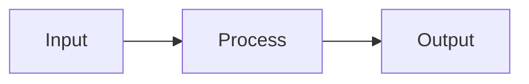

# Marko Pollo

A markdown-to-slides presentation engine with a dark cinematic visual identity, built for developer talks at tech conferences, meetups, and engineering presentations.

<!-- TODO: Add screenshot of a presentation slide here -->

## Features

- **Markdown slides** — Write slides in a single `.md` file, separated by `---`
- **Syntax highlighting** — VS Code-grade code highlighting via Shiki, with diff, focus, and line highlight support
- **Mermaid diagrams** — Client-side rendered diagrams with branded theming
- **GFM support** — Tables, strikethrough, task lists, and autolinks with custom styling
- **Live editor** — Built-in split-pane CodeMirror editor with instant preview
- **Overview grid** — Thumbnail view of all slides, click to jump
- **Keyboard navigation** — Full keyboard control for presenting
- **Dark theme** — Branded dark cinematic palette, no light mode
- **Emoji shortcodes** — `:rocket:` becomes :rocket:
- **File drop** — Drag and drop `.md` files to load them
- **URL loading** — Load remote slide decks via URL parameter
- **Zero backend** — Static SPA, works from any web server or `file://`

## Quick Start

```bash
git clone <repo-url>
cd marko-pollo
npm install
npm run dev
```

Open [http://localhost:5173](http://localhost:5173) to view the default presentation.

## Keyboard Shortcuts

| Key | Action |
|-----|--------|
| Right / Space / PageDown | Next slide |
| Left / Backspace / PageUp | Previous slide |
| Home | First slide |
| End | Last slide |
| F | Toggle fullscreen |
| O | Toggle overview grid |
| E | Toggle editor |
| Escape | Exit fullscreen / overview / back to presentation |
| 1-9 | Jump to slide 1-9 |

## Views

**Presentation** (`/#/`) — Fullscreen slide display. One slide at a time with keyboard navigation, progress bar, and slide counter.

**Editor** (`/#/editor`) — Split pane with a CodeMirror markdown editor on the left (40%) and live slide preview on the right (60%). Changes are saved to localStorage automatically.

**Overview** (`/#/overview`) — Thumbnail grid of all slides. Click any slide to jump to it in presentation mode.

Press **O** or **E** to switch views from the keyboard.

## Custom Presentations

### Built-in editor

Press **E** to open the editor and start writing. Your changes persist in localStorage across refreshes.

### Drag and drop

Drag a `.md` file onto the browser window to load it.

### URL parameter

```
https://your-host/#?url=https://example.com/slides.md
```

Only HTTPS URLs are supported.

### Slide format

```markdown
---
title: My Talk
author: Jane Dev
---

# First Slide

Content here.

---

# Second Slide

- Bullet points
- With **bold** and *italic*

---

## Code Example

```typescript
function hello(): string {
  return "world"
}
```

---

## Diagram


```

### Per-slide metadata

Add HTML comments at the start of a slide to customize it:

```markdown
<!-- bg: #1a1a2e -->

# Custom Background Slide
```

## Development

```bash
npm run dev        # Start dev server with HMR
npm run build      # Type-check and production build
npm run preview    # Preview production build locally
npm run test       # Run unit tests in watch mode
npm run test:run   # Run unit tests once
npx playwright test  # Run E2E tests (requires browsers installed)
npm run lint       # Lint with ESLint
```

## Tech Stack

| Layer | Technology |
|-------|-----------|
| Build | Vite + React 19 + TypeScript |
| Markdown | unified / remark-parse / remark-gfm / react-markdown |
| Code highlighting | Shiki + @shikijs/transformers |
| Diagrams | Mermaid.js v11 |
| Editor | CodeMirror 6 (@uiw/react-codemirror) |
| Styling | CSS Modules + CSS custom properties |
| State | React Context + useReducer |
| Testing | Vitest + Testing Library + Playwright |

## License

TBD
