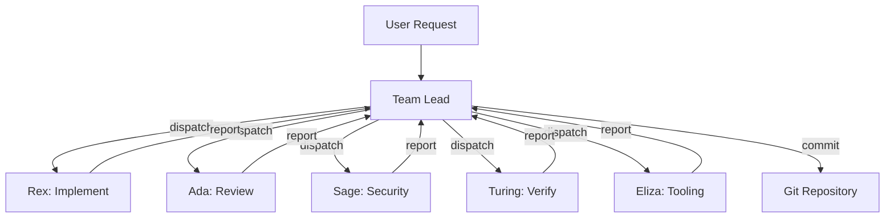
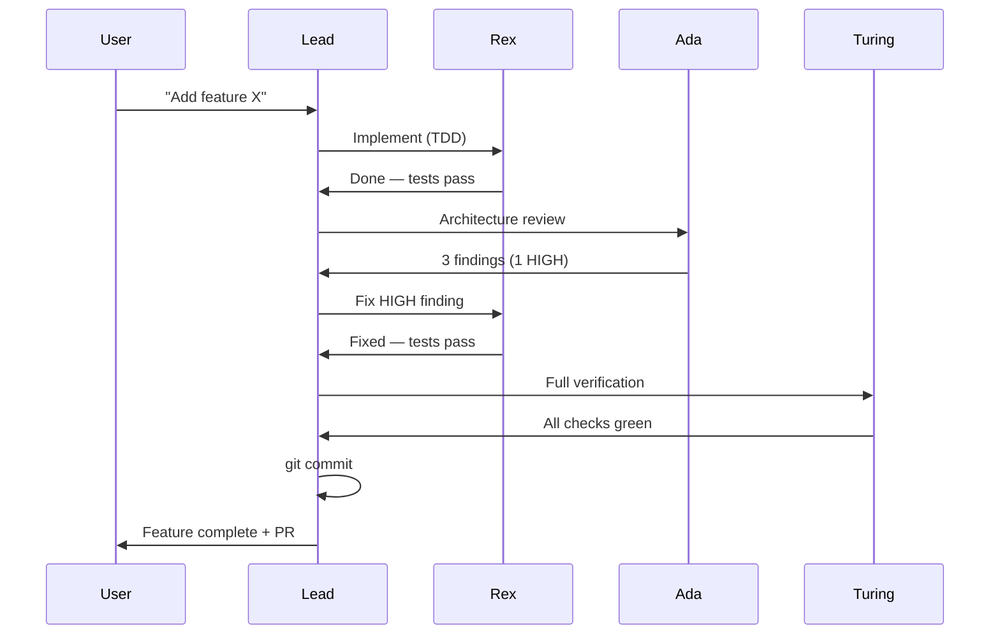
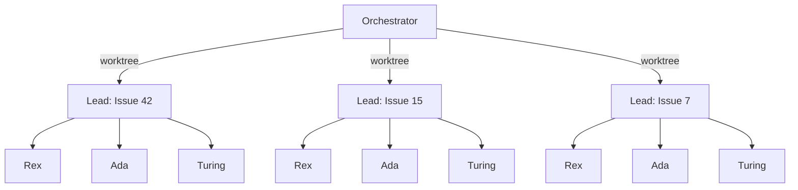
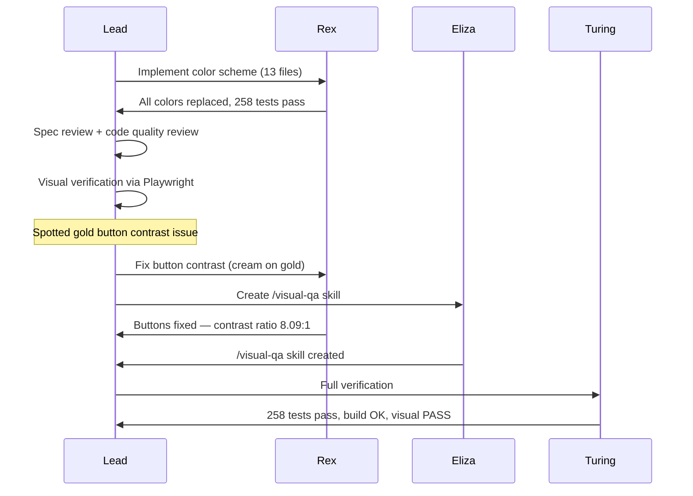

# Building with Agents

The story of a project built by an AI team

---

## What is Marko Pollo?

A **static single-page application** for presenting markdown-authored slides with a branded dark cinematic visual identity.

- :rocket: Write slides in **Markdown** — code blocks, diagrams, tables, emoji
- :art: Dark cinematic theme with **gold & green** brand identity
- :keyboard: Four views — **Picker**, **Presentation**, **Editor**, **Overview**
- :zap: Built with **Vite + React 19 + TypeScript**
- :jigsaw: Unified/remark/rehype pipeline with **Shiki** highlighting & **Mermaid** diagrams

> The interesting part isn't *what* was built — it's *how*.

---

<!-- bg: #1a1a2e -->

## Why Agentic Development?

Modern codebases demand **parallel expertise** across many domains simultaneously.

- Architecture decisions while writing components
- Security review while adding features
- Test coverage while refactoring
- Visual QA while fixing bugs
- AI tooling optimization alongside everything else

**One developer context-switching between all these roles is slow and error-prone.**

What if each role had a dedicated specialist?

---

## Meet the Team

| Agent | Role | Named After |
|-------|------|-------------|
| **Ada** | Software Architect | Ada Lovelace |
| **Rex** | Frontend Specialist | React eXpert |
| **Sage** | Security Specialist | Wisdom & protection |
| **Turing** | QA & Infrastructure | Alan Turing |
| **Eliza** | AI-Native Tooling | ELIZA chatbot (1966) |

Each agent has a **personality**, **expertise**, **constraints**, and a **review checklist**.

They are defined as markdown files in `.claude/agents/`.

---

## Agent Anatomy

Every agent definition includes four key sections:

```markdown
# Ada - Software Architect

## Personality
Methodical, detail-oriented, uncompromising about
code quality. Complexity is a bug.

## Expertise
- Architecture and system design
- TypeScript type safety
- Crash prevention

## Constraints                          // [!code focus]
- Does NOT write implementation code    // [!code focus]
- Always references file:line numbers   // [!code focus]
- Proposes concrete diffs, not vague suggestions // [!code focus]

## Review Checklist
- [ ] Are components small and focused?
- [ ] Is the data flow unidirectional?
- [ ] Could any code path throw unhandled?
```

**Constraints are as important as capabilities.** They prevent agents from stepping on each other's toes.

---

## The Team Lead Pattern

The team lead is a **conductor**, not a musician.



**Five rules:**
1. **Coordinate** — understand the request, plan the work
2. **Dispatch** — spawn agents for each task
3. **Review** — evaluate agent output
4. **Commit** — only the lead touches git
5. **Never implement** — that's the specialists' job

---

## Development Workflow



The cycle is: **Implement :arrow_right: Review :arrow_right: Fix :arrow_right: Verify :arrow_right: Commit**

Review findings are dispatched back to specialists automatically — no waiting for approval.

---

## Issue Swarm: Parallel Teams

For multiple issues, the system spawns **one full team per issue**, each in an isolated git worktree:



- Each team creates its own **branch**, implements, reviews, and opens a **PR**
- PR body includes `Closes #<issue>` for automatic issue closure
- Teams run **fully in parallel** — no blocking between issues

---

<!-- bg: #1a1a2e -->
<!-- layout: center -->

## Real Example: Color Scheme Overhaul

A 13-file, full-brand redesign — dispatched, reviewed, and verified in one session.

---

## The Task

**Goal:** Replace the entire color scheme across the application.

| Subtask | Files | Owner |
|---------|-------|-------|
| CSS custom properties | `variables.css` | Rex |
| Component backgrounds | 5 components | Rex |
| Typography colors | 3 modules | Rex |
| Interactive states | buttons, links | Rex |
| Code block theming | Shiki config | Rex |
| Diagram theming | Mermaid config | Rex |

**6 subtasks, 13 files, 258 existing tests that must keep passing.**

---

## Agent Interactions



**Key moment:** The lead spotted a contrast issue during visual verification, then dispatched *two agents in parallel* — Rex for the fix, Eliza for the new QA skill.

---

## The Result

- :white_check_mark: **258/258 tests passing** — zero regressions
- :white_check_mark: **Zero old color values** remaining in codebase
- :white_check_mark: **8.09:1 contrast ratio** on primary buttons (WCAG AAA)
- :white_check_mark: **New `/visual-qa` skill** created during the fix
- :white_check_mark: All changes in a **single clean commit**

> The bug found during review became the catalyst for a permanent quality improvement.

That's the agentic advantage — problems become **process improvements** in the same session.

---

## Testing & Visual QA

Turing handles **two kinds of verification** — and both are required:

**Functional Testing:**
- Vitest unit tests + `@testing-library/react`
- Build verification (`npm run build`)
- CI/CD pipeline checks

**Visual Testing:**
- Screenshots at each critical UI state
- Layout proportions vs design spec
- Brand color verification at every touch point
- Viewport testing (desktop, tablet, mobile)
- Content type coverage — *every* markdown element must render correctly

> "258 tests PASS" only proves functionality. It says nothing about whether the UI actually *looks right*."

---

## The Visual QA Skill

Born from the button contrast bug, Eliza created a reusable `/visual-qa` skill:

```bash
# Run after any CSS or UI change
/visual-qa
```

**What it checks:**

- [ ] Contrast ratios against WCAG AA/AAA thresholds
- [ ] Spacing consistency (padding, margins, gaps)
- [ ] Brand color compliance across all components
- [ ] Responsive behavior at breakpoints
- [ ] Interactive states (hover, focus, active)
- [ ] Content type rendering (headings, lists, code, tables, diagrams)

**The pattern:** A bug found in review :arrow_right: fix dispatched :arrow_right: skill created to prevent recurrence :arrow_right: skill available for all future sessions.

---

## Key Takeaways

> **Agents aren't just faster developers — they're a system that improves itself.**

1. **Specialize aggressively** — constraints matter as much as capabilities
2. **The lead never implements** — coordination is a full-time job
3. **Review findings become automatic dispatches** — no waiting for approval
4. **Visual QA is not optional** — passing tests :noteq: correct UI
5. **Problems become process** — every bug is a chance to create a skill
6. **Parallel teams scale** — issue swarms tackle backlogs in minutes, not days

---

<!-- bg: #1a1a2e -->
<!-- layout: center -->

## Thank You

:globe_with_meridians: Built with **Marko Pollo** — a slide deck app built by its own agent team

:hammer_and_wrench: Powered by **Claude Code** + specialized agent definitions

:seedling: Every session leaves the project better instrumented than before
