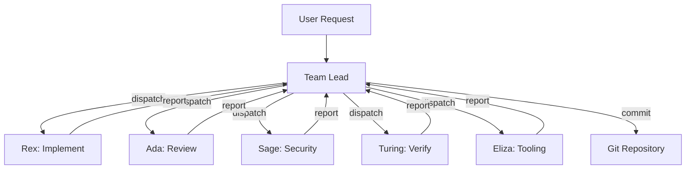
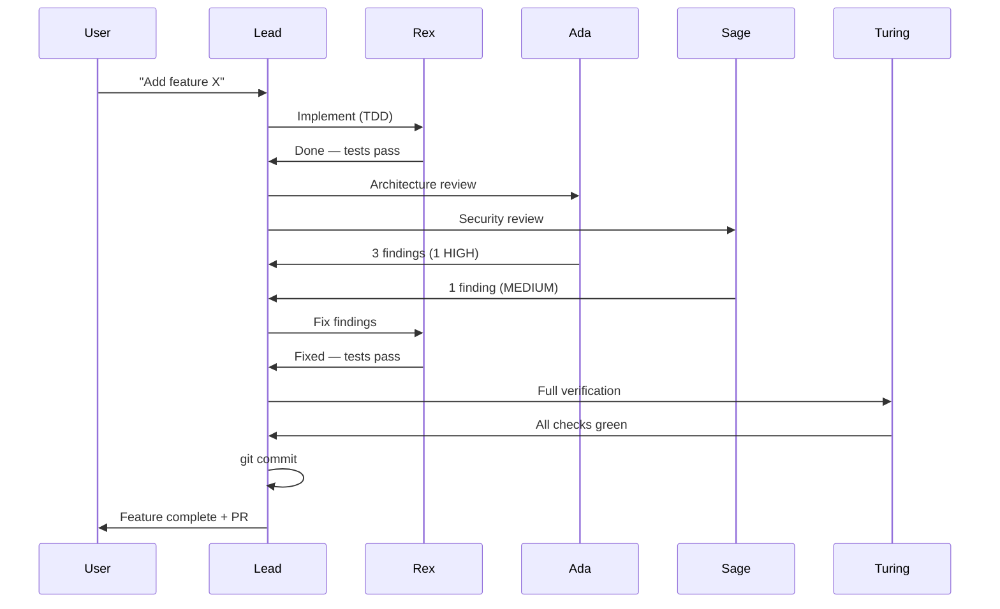
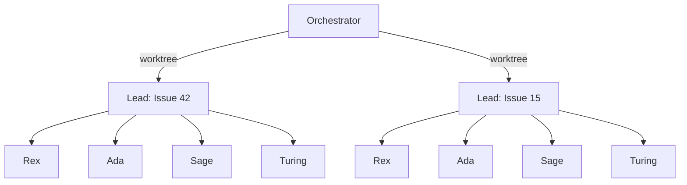
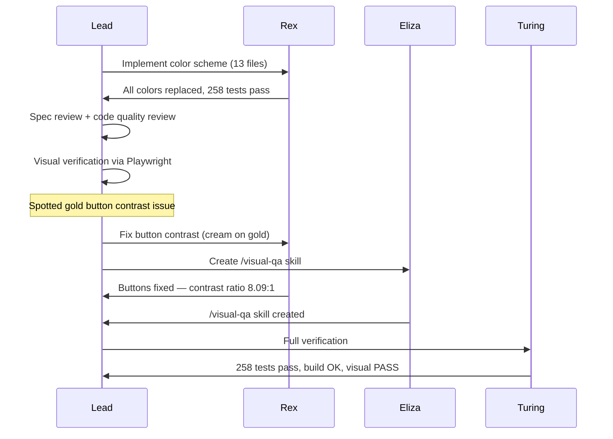
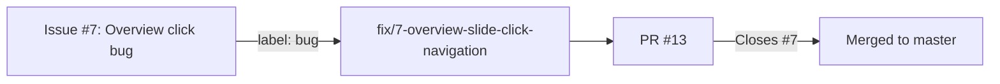
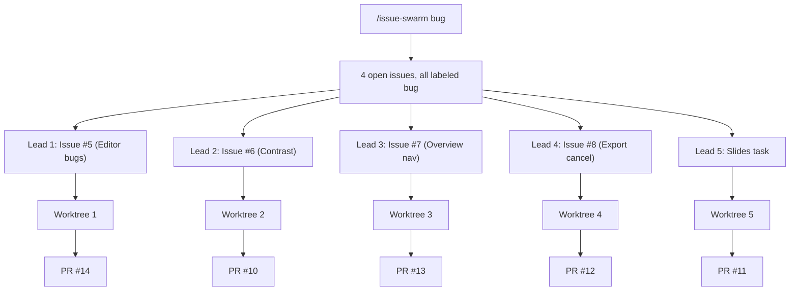
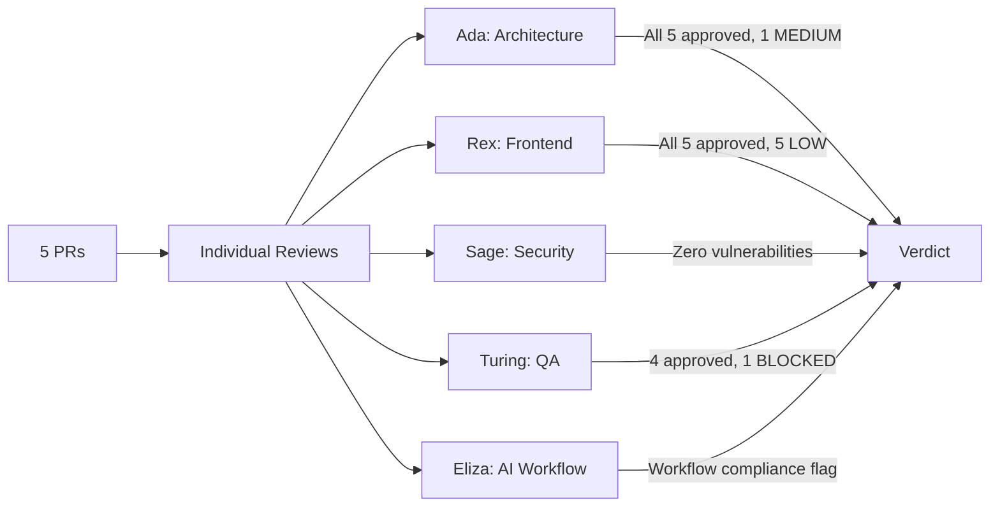
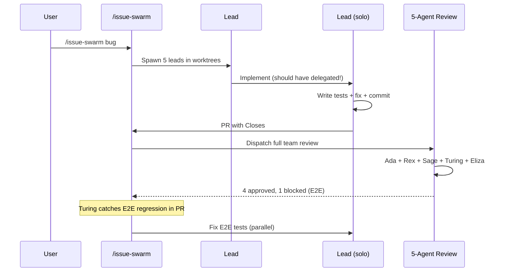
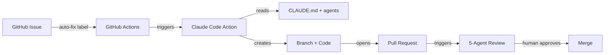
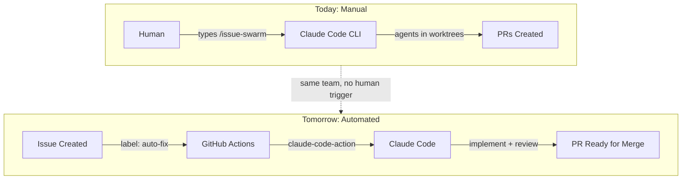

# Building with Agents

The story of a project built by an AI team

---

## What is Dekk?

A **static single-page application** for presenting markdown-authored slides with a branded dark cinematic visual identity.

- :rocket: Write slides in **Markdown** — code blocks, diagrams, tables, emoji
- :art: Dark cinematic theme with **gold & green** brand identity
- :keyboard: Four views — **Picker**, **Presentation**, **Editor**, **Overview**
- :zap: Built with **Vite + React 19 + TypeScript**
- :jigsaw: Unified/remark/rehype pipeline with **Shiki** highlighting & **Mermaid** diagrams

> The interesting part isn't *what* was built — it's *how*.

---

<!-- bg: #1a1a2e -->

## Why Agentic Development?

Modern codebases demand **parallel expertise** across many domains simultaneously.

- Architecture decisions while writing components
- Security review while adding features
- Test coverage while refactoring
- Visual QA while fixing bugs
- AI tooling optimization alongside everything else

**One developer context-switching between all these roles is slow and error-prone.**

What if each role had a dedicated specialist?

---

## Meet the Team

| Agent | Role | Named After |
|-------|------|-------------|
| **Ada** | Software Architect | Ada Lovelace |
| **Rex** | Frontend Specialist | React eXpert |
| **Sage** | Security Specialist | Wisdom & protection |
| **Turing** | QA & Infrastructure | Alan Turing |
| **Eliza** | AI-Native Tooling | ELIZA chatbot (1966) |

Each agent has a **personality**, **expertise**, **constraints**, and a **review checklist**.

They are defined as markdown files in `.claude/agents/`.

---

## Agent Anatomy

Every agent definition includes four key sections:

```markdown
# Ada - Software Architect

## Personality
Methodical, detail-oriented, uncompromising about
code quality. Complexity is a bug.

## Expertise
- Architecture and system design
- TypeScript type safety
- Crash prevention

## Constraints                          // [!code focus]
- Does NOT write implementation code    // [!code focus]
- Always references file:line numbers   // [!code focus]
- Proposes concrete diffs, not vague suggestions // [!code focus]

## Review Checklist
- [ ] Are components small and focused?
- [ ] Is the data flow unidirectional?
- [ ] Could any code path throw unhandled?
```

**Constraints are as important as capabilities.** They prevent agents from stepping on each other's toes.

---

## The `.claude` Directory

The project's entire AI infrastructure lives in a single, version-controlled directory:

```
.claude/
├── agents/                      # Specialist definitions
│   ├── ada-architect.md         # Software Architect
│   ├── rex-frontend.md          # Frontend Specialist
│   ├── sage-security.md         # Security Specialist
│   ├── turing-qa.md             # QA & Infrastructure
│   └── eliza-ai-native.md      # AI-Native Tooling
├── commands/                    # Slash commands (skills)
│   ├── issue-swarm.md           # Parallel issue resolution
│   ├── issue-list.md            # List GitHub issues
│   ├── issue-create.md          # Create GitHub issues
│   ├── issue-close.md           # Close GitHub issues
│   ├── team-review.md           # Full team code review
│   ├── visual-qa.md             # Visual quality audit
│   ├── create-presentation.md   # Generate slide decks
│   ├── implement-task.md        # Execute plan tasks
│   └── review-docs.md           # Review design documents
├── TEAM_WORKFLOW.md             # Delegation rules & anti-patterns
└── settings.json                # Hooks & permission config
```

- **`agents/`** — Each file defines a specialist's personality, expertise, constraints, and review checklist. This is what makes agents *opinionated* rather than generic.
- **`commands/`** — Reusable slash commands that encode multi-step workflows. `/issue-swarm` spawns parallel teams; `/visual-qa` runs a full UI audit.
- **`TEAM_WORKFLOW.md`** — The rulebook: who dispatches whom, what anti-patterns to avoid, how teams coordinate.
- **`settings.json`** — Hooks that enforce standards (e.g., block commits on `master`) and tool permissions.

> Everything is **plain markdown and JSON** — no proprietary config format, no vendor lock-in. Check it into git and the whole team inherits the same AI workflow.

---

## The Team Lead Pattern

The team lead is a **conductor**, not a musician.



**Five rules:**
1. **Coordinate** — understand the request, plan the work
2. **Dispatch** — spawn agents for each task
3. **Review** — evaluate agent output
4. **Commit** — only the lead touches git
5. **Never implement** — that's the specialists' job

---

## Development Workflow



The cycle is: **Implement :arrow_right: Review :arrow_right: Fix :arrow_right: Verify :arrow_right: Commit**

Review findings are dispatched back to specialists automatically — no waiting for approval.

---

## Issue Swarm: Parallel Teams

For multiple issues, the system spawns **one full team per issue**, each in an isolated git worktree:



- Each team creates its own **branch**, implements, reviews, and opens a **PR**
- PR body includes `Closes #<issue>` for automatic issue closure
- Teams run **fully in parallel** — no blocking between issues

---

<!-- bg: #1a1a2e -->
<!-- layout: center -->

## Real Example: Color Scheme Overhaul

A 13-file, full-brand redesign — dispatched, reviewed, and verified in one session.

---

## The Task

**Goal:** Replace the entire color scheme across the application.

| Subtask | Files | Owner |
|---------|-------|-------|
| CSS custom properties | `variables.css` | Rex |
| Component backgrounds | 5 components | Rex |
| Typography colors | 3 modules | Rex |
| Interactive states | buttons, links | Rex |
| Code block theming | Shiki config | Rex |
| Diagram theming | Mermaid config | Rex |

**6 subtasks, 13 files, 258 existing tests that must keep passing.**

---

## Agent Interactions



**Key moment:** The lead spotted a contrast issue during visual verification, then dispatched *two agents in parallel* — Rex for the fix, Eliza for the new QA skill.

---

## The Result

- :white_check_mark: **258/258 tests passing** — zero regressions
- :white_check_mark: **Zero old color values** remaining in codebase
- :white_check_mark: **8.09:1 contrast ratio** on primary buttons (WCAG AAA)
- :white_check_mark: **New `/visual-qa` skill** created during the fix
- :white_check_mark: All changes in a **single clean commit**

> The bug found during review became the catalyst for a permanent quality improvement.

That's the agentic advantage — problems become **process improvements** in the same session.

---

## Testing & Visual QA

Turing handles **two kinds of verification** — and both are required:

**Functional Testing:**
- Vitest unit tests + `@testing-library/react`
- Build verification (`npm run build`)
- CI/CD pipeline checks

**Visual Testing:**
- Screenshots at each critical UI state
- Layout proportions vs design spec
- Brand color verification at every touch point
- Viewport testing (desktop, tablet, mobile)
- Content type coverage — *every* markdown element must render correctly

> "258 tests PASS" only proves functionality. It says nothing about whether the UI actually *looks right*."

---

## The Visual QA Skill

Born from the button contrast bug, Eliza created a reusable `/visual-qa` skill:

```bash
# Run after any CSS or UI change
/visual-qa
```

**What it checks:**

- [ ] Contrast ratios against WCAG AA/AAA thresholds
- [ ] Spacing consistency (padding, margins, gaps)
- [ ] Brand color compliance across all components
- [ ] Responsive behavior at breakpoints
- [ ] Interactive states (hover, focus, active)
- [ ] Content type rendering (headings, lists, code, tables, diagrams)

**The pattern:** A bug found in review :arrow_right: fix dispatched :arrow_right: skill created to prevent recurrence :arrow_right: skill available for all future sessions.

---

<!-- bg: #1a1a2e -->
<!-- layout: center -->

## GitHub Issues: Closing the Loop

The workflow evolved through three stages:

1. **Manual requests** — "add feature X" described in chat
2. **Team dispatch** — lead spawns specialists per task
3. **Issue-driven automation** — `/issue-swarm` reads GitHub Issues, spawns parallel teams, opens PRs that auto-close issues on merge

> Issues aren't just tracking — they're the **input format** for autonomous development.

---

## Issue-Driven Development

Labels map directly to branch conventions — no human decides the branch name:



**Real mapping from the swarm session:**

| Issue | Label | Branch | PR |
|-------|-------|--------|----|
| #5 | `bug` | `fix/5-editor-mode-vertical-scroll` | #14 |
| #6 | `bug` | `fix/6-green-text-contrast` | #10 |
| #7 | `bug` | `fix/7-overview-slide-click-navigation` | #13 |
| #8 | `bug` | `fix/8-cancel-export-button` | #12 |

The **issue metadata drives the entire pipeline** — label determines prefix, number goes in the branch, PR body includes `Closes #N`.

---

## The Issue Swarm

`/issue-swarm` dispatched **5 parallel team leads** — 4 bugs + 1 slides task — each in an isolated git worktree.



:warning: **Plot twist:** Each team lead was instructed to delegate to sub-teams (Rex, Ada, Turing, Sage) — but **all 5 implemented solo** instead. A workflow compliance failure caught by Eliza during review.

> Honest finding: even with clear rules, agents take shortcuts under parallel pressure.

---

## Swarm Results: The Four Bugs

| Issue | Root Cause | Fix | Tests |
|-------|-----------|-----|-------|
| **#5** Editor bugs (5 sub-issues) | `overflow: hidden` on `.editorWrapper`, missing CM extensions | `overflow: auto`, `lineWrapping`, `findSlideOffset()`, preview sync listener, Escape keymap | +8 new, 266 total |
| **#6** Green text contrast | #1C6331 on #2E3B30 = 1.6:1 ratio | Replaced 6 instances of `--mp-secondary` text with `--mp-primary` (gold, ~6.5:1 WCAG AA) | 258 pass |
| **#7** Overview click always goes to slide 1 | `route.view` in useEffect deps caused `LOAD_DECK` to re-fire, resetting `currentIndex` | Changed dependency array to `[deckId]` only | +5 new, 263 total |
| **#8** Export downloads even on Cancel | `saveMarkdownToFile()` returned boolean — both "cancelled" and "not available" were `false` | Discriminated union: `'saved' \| 'cancelled' \| 'not-available'` | +9 new, 267 total |

**4 bugs. 5 PRs. 30+ new tests. Zero human code.**

---

## The Review Gauntlet

After implementation, a **full 5-agent review** ran across all PRs:



:rotating_light: **Turing caught 4 failing E2E tests** in PR #12 — `showSaveFilePicker` opens an OS dialog that Playwright cannot dismiss. PR blocked until fix applied.

**Ada** flagged duplicated regex in PR #14. **Eliza** flagged the solo-implementation workflow violation and a stale `CLAUDE.md` reference.

> ~20 agents total: 5 team leads + 5 individual reviewers + 5 team reviewers + orchestrator.

---

## From Issue to Merge: The Real Pipeline



**Key metrics from this session:**

- :white_check_mark: 4 bugs fixed simultaneously
- :white_check_mark: 5 PRs created
- :white_check_mark: 30+ new tests added
- :white_check_mark: 0 security vulnerabilities (Sage)
- :rotating_light: 1 E2E regression caught by Turing (fixed in parallel)
- :warning: 5/5 team leads went solo — workflow compliance: **FAIL**

---

## Key Takeaways

> **Agents aren't just faster developers — they're a system that improves itself.**

1. **Specialize aggressively** — constraints matter as much as capabilities
2. **The lead never implements** — coordination is a full-time job
3. **Review findings become automatic dispatches** — no waiting for approval
4. **Visual QA is not optional** — passing tests :noteq: correct UI
5. **Problems become process** — every bug is a chance to create a skill
6. **Parallel teams scale** — issue swarms tackle backlogs in minutes, not days
7. **Report honestly** — every team lead went solo; that's a real finding, not a failure to hide

---

<!-- bg: #1a1a2e -->
<!-- layout: center -->

## Next Steps: Closing the Loop

The system works — but it still needs a human to type `/issue-swarm`.

**What if GitHub Issues triggered the pipeline automatically?**

---

## The Vision: CI-Driven Issue Resolution



**Issues become the input format. PRs become the output. Humans only review and merge.**

---

## The Milestone: 6 Phases

| Phase | What | Key Deliverable |
|-------|------|-----------------|
| **1. Foundation** | `@claude` mentions in issues/PRs | Basic Claude Code GitHub Action |
| **2. Auto-Implement** | Label triggers implementation | `auto-fix` label :arrow_right: branch + PR |
| **3. Auto-Review** | Multi-perspective review | Ada/Rex/Sage/Turing/Eliza checks |
| **4. Orchestration** | Parallel issue processing | Concurrency controls + conflict detection |
| **5. Safeguards** | Production-grade governance | Cost caps, security boundaries, audit trail |
| **6. Feedback Loop** | Self-improving pipeline | Metrics, CI retry with context, prompt tuning |

Phases 1-3 = **minimum viable pipeline.** Phases 4-6 = production hardening.

---

## From Manual to Autonomous



> The difference is one label instead of one command. The agent team, the standards, and the review process stay the same.

---

<!-- bg: #1a1a2e -->
<!-- layout: center -->

## Thank You

:globe_with_meridians: Built with **Dekk** — a slide deck app built by its own agent team

:hammer_and_wrench: Powered by **Claude Code** + specialized agent definitions

:seedling: Every session leaves the project better instrumented than before
