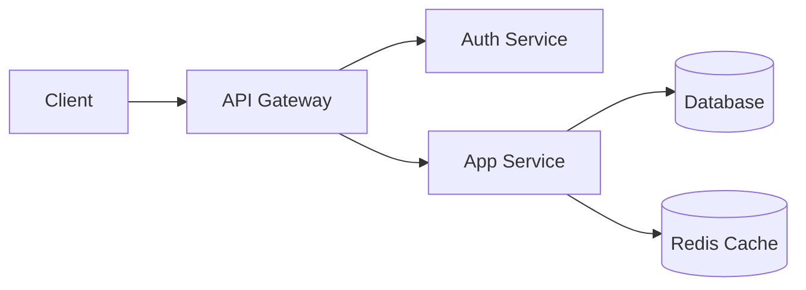
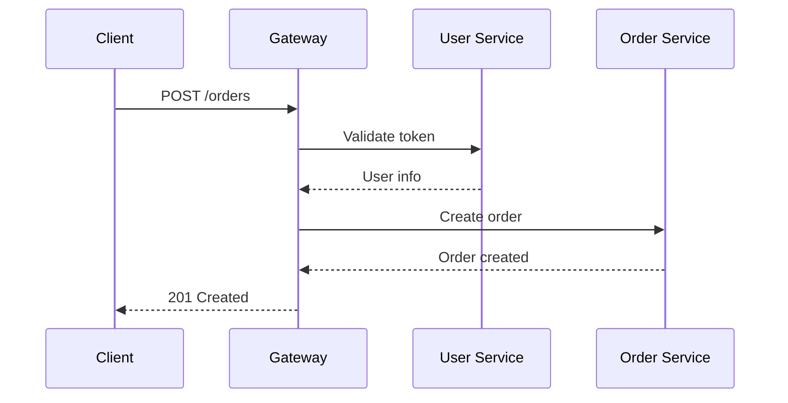

# Architecture Patterns

Design principles for scalable software systems

---

## Request Flow

---

## Layered Architecture

| Layer | Responsibility | Example |
|-------|---------------|---------|
| Presentation | UI rendering | React components |
| Application | Business logic | Use cases, services |
| Domain | Core models | Entities, value objects |
| Infrastructure | External systems | Database, APIs |

**Key rule:** Dependencies point **inward** — infrastructure depends on domain, never the reverse.

---

## Service Communication

---

## Choosing a Pattern

- **Monolith**
  - Start here for most projects
  - Simple deployment and debugging
  - Scale vertically first
- **Microservices**
  - When teams need independent deployment
  - When services have different scaling needs
  - Adds operational complexity
- **Event-Driven**
  - When systems need loose coupling
  - When processing is asynchronous
  - Requires message broker infrastructure

---

## Key Takeaways

1. Start simple — choose the **simplest architecture** that solves the problem
2. Separate concerns with clear **boundaries**
3. Make dependencies explicit and **unidirectional**
4. Design for **change**, not for prediction
